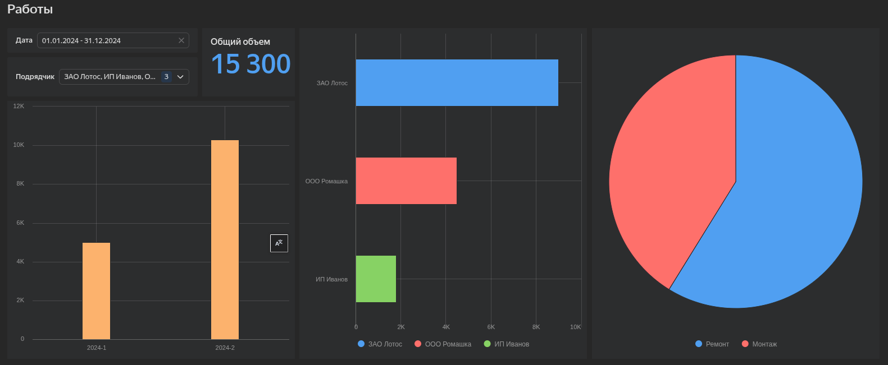

# Пояснения к решению

Результаты:
1. Таблица output.xlsx
2. Дашборд  https://datalens.yandex/kpqcp1f3nb2c4

**Обработка данных**

**Дата** была обработана исходя из того, что возможны переходящие записи реестра с одного месяца на другой. В подобных случаях я обычно уточнях данные у операторов или подрядчиков. По умолчанию доверяю больше дате в файле чем дате в названии файла. Неявный формат даты может скрывать путаницу дня и месяца.

**Отсутствующие значения** были удалены так как невозможно установить объем и дату. Требует уточнения у вводившего данные или у подрядчика.\
**Категориальные значения** где надо были удалены пробелы, но в общем случае необходим подход со справочником

**Дашборд** реализован в Datalens на основании статичного файла output.xlsx. В зависимости от потребностей можно в дальнейшем еще больше автоматизировать процесс, предприняв следующие шаги
1. Сохранять скриптом данные в Google Spreadsheets как источник данных для Datalens
2. Или поднять на VPS сервер для сохранения данных в PostgresSQL как источник данных для Datalens
3. Или использовать на VPS дашборд на основании DataLens
4. Использовать streamlit или dash интерфейс

Любой из подходов я могу реализовать в зависимости от требований.
Одно ограничение - предпочитаю не использовать продукты Microsoft.